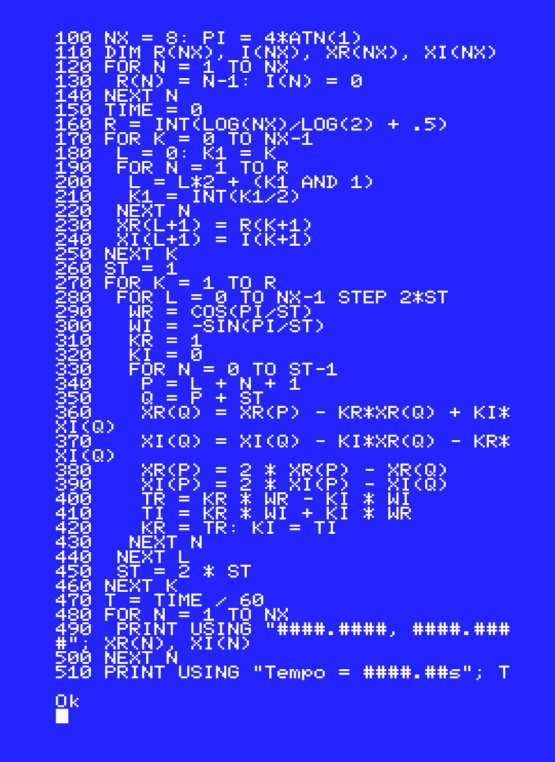

# Retrocomputing Version

With the recent passing of Sir Clive Sinclair (at the moment I'm writing this document, it is September, 20, 2021), I was feeling a bit nostalgic, and decide to try to implement the Fast Fourier Transform in some of the architectures that I used when I was a kid, and in which I started to learn about computers. The results are in this folder.

The programs were implemented for two architectures: the ZX-Spectrum and the MSX, both using their respective BASIC distribution. Both of these computers had different programming languages that were more resource efficient and faster, but since I don't have access to any of these, I went with what I had.

I used emulators available online to test the programs:

* [Qaop - ZX Spectrum Emulator](http://torinak.com/qaop) for the ZX Spectrum.
* [WebMSX](https://webmsx.org/) for MSX.

The implementations are surprisingly similar. I remember that, at that time, people used to complain on how the machines were different, and how it was difficult to develop for more than one architecture at the same time. This was true, of course, because, beyond the simplest BASIC commands, colors, graphics and sound were always handled differently from one machine to the other and, given that computers were slow at that time, a lot had to be implemented using machine code, and that was difficult.

The programs themselves needed some attention. BASIC at those computers didn't have a lot of resources that we take for granted today. There wasn't support for complex numbers, so I had to use one array to represent real values, and other to represent imaginary values. Also, functions and subroutines were handled quite differently and I couldn't count on them to ease the work. Most of the operations are inlined. This, anyway, would be a necessity in any BASIC program, since jumping to subroutines were time demanding.

To run the programs, there is no other way: just type and hit `run` -- the listings are on images instead of text files. Although emulators *have* ways to save and read external files, on those days we would type the programs line by line, checking where were the errors and why the programs weren't working. This should be a full nostalgic experience.

I had some problems while typing the programs. For example, since I'm in a Samsumg laptop, I couldn't type type the division symbol (`/`), because the `Alt Gr` key must be used, and the emulator were understanding it as a key modifier. I had to use an external keyboard. Keyboard layout was also a problem, but the emulators in general have a help function for these cases. Also, I couldn't remember a lot of commands, and had to search for manuals online to remember them.

To check how slow the computers were at that time, the table below show execution times on the MSX (I couldn't remember how to extract times on the ZX Spectrum). First column is the size of the vector being transformed; second column is the complexity of the DFT and third the complexity of the FFT. The columns marked as `dft` and `fft` are the ideal times using the 8-point DFT as reference. The `measured` columns are the actual time on the processing. Please, notice that times are given in *seconds*:

|  n  |  n^2  | n log n |  dft | measured |  fft  | measured |
|:---:|:-----:|:-------:|:----:|:--------:|:-----:|:--------:|
|  8  |   64  |    24   |   1  |     5    | 0.375 |   3.68   |
|  16 |  256  |    64   |   4  |   23.7   |  1.0  |   8.82   |
|  32 |  1024 |   160   |  16  |   98.3   |  2.5  |   20.08  |
|  64 |  4096 |   384   |  64  |  406.23  |  6.0  |   48.25  |
| 128 | 16384 |   896   |  256 |    --    |  14.0 |  110.05  |
| 256 | 65536 |   2048  | 1024 |    --    |  32.0 |   248.8  |

The actual measured times are not the exact multiples of their reference. This happens -- probably -- because there are a lot of under-the-hood bookkeeping that the computers are doing. The programs could probably be further optimized, but that is left as an exercise to the motivated reader (share your results).

As expected, there is a huge gain in using the fast algorithm. I wasn't able to run the DFT for 128 or 256 samples, but I got a result quite quickly using the FFT.

## ZX Spectrum

The image below show the listing for the direct FT, implemented from the definition. The next image show the results:

The following image shows the fast FT, with the results following:

## MSX

The image below show the listing for the direct FT, implemented from the definition. The next images show the results for 8 and 16 samples:

The following image shows the fast FT, with the results for 8, 16 and 64 samples following:

